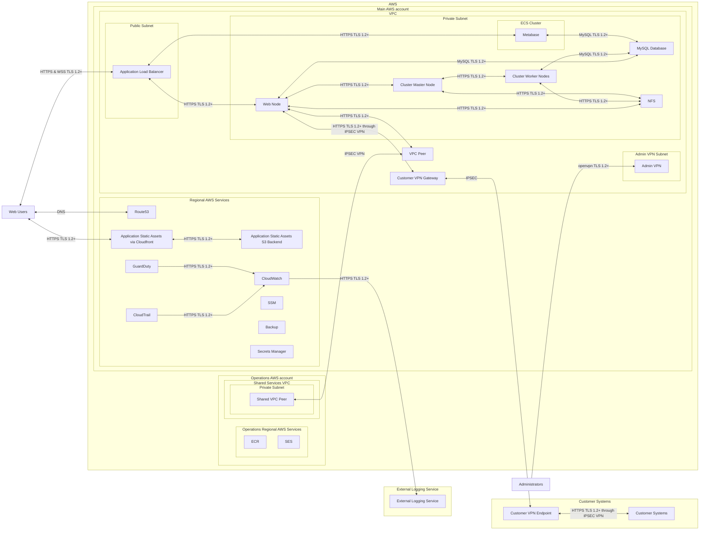

# AWS Application

The following diagram is a global system view of an application hosted in AWS. This view of the system aims to describe all of the internal and external connections of the individual components. Downstream threat models are expected to reference the global system view and all connections between components.

