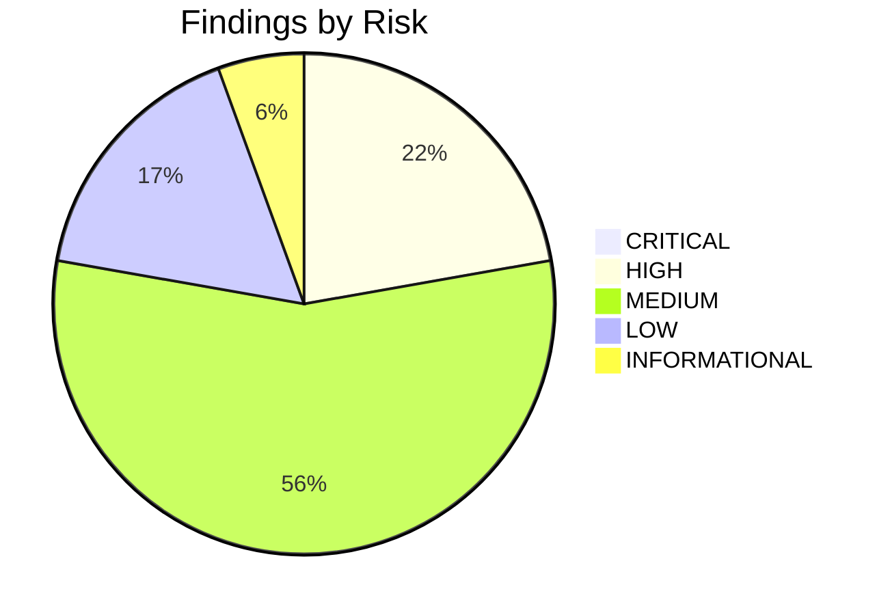
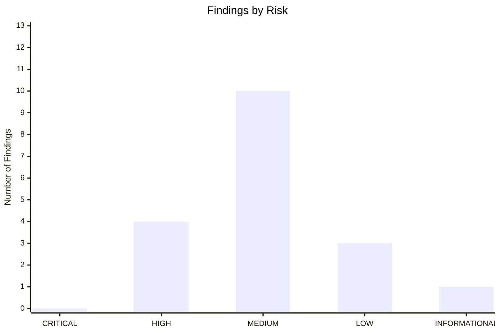
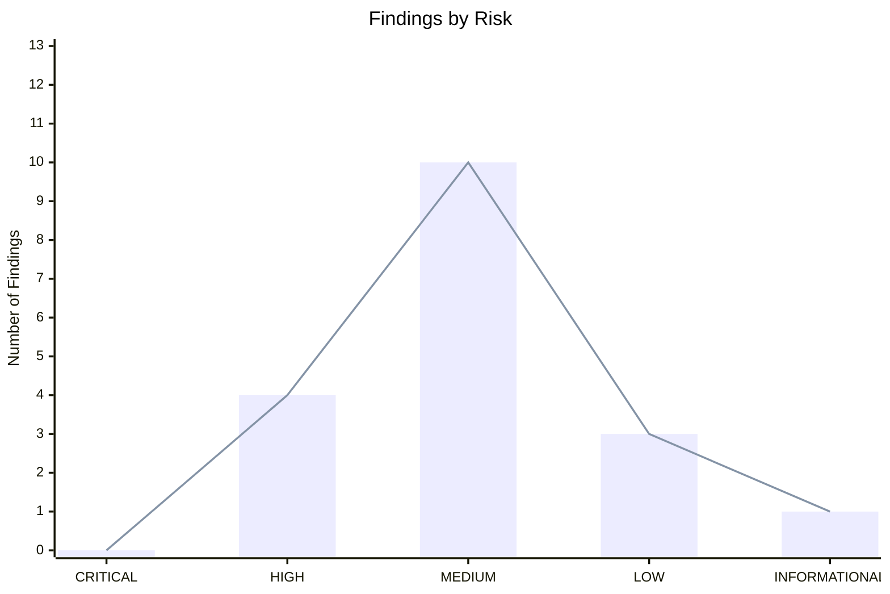

# Results Summary

Examples of different charts.

## Pie Chart



## Bar Graph



## Line Graph

```mermaid
---
config:
    xyChart:
        width: 900
        height: 600
    themeVariables:
        xyChart:
            titleColor: "#000000"
---
xychart-beta
    title "Findings by Risk"
    x-axis [CRITICAL, HIGH, MEDIUM, LOW, INFORMATIONAL]
    y-axis "Number of Findings" 0 --> 13
    line [0, 4, 10, 3, 1]
```

## Bar and Line Combined


