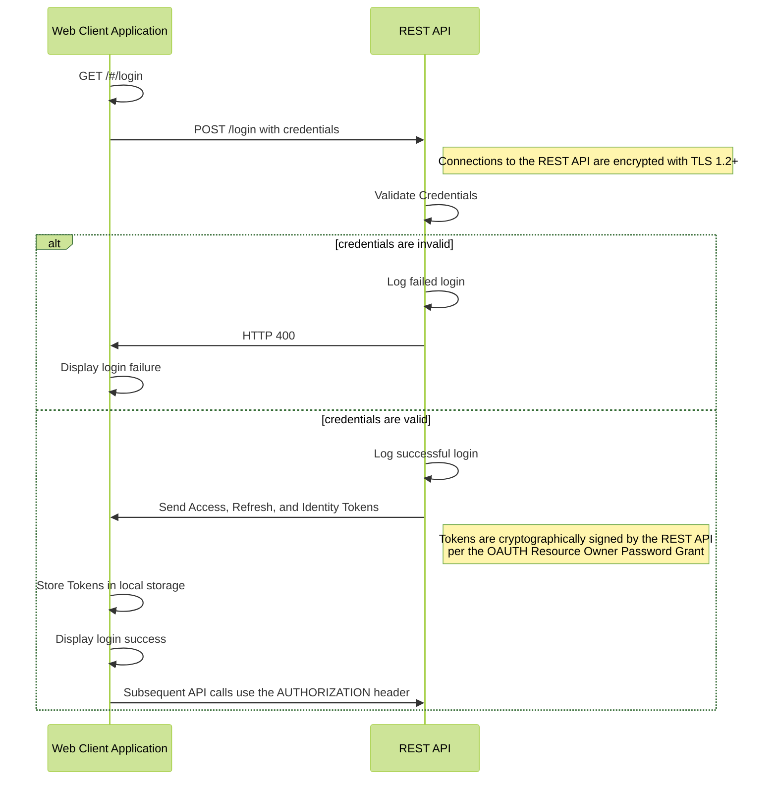
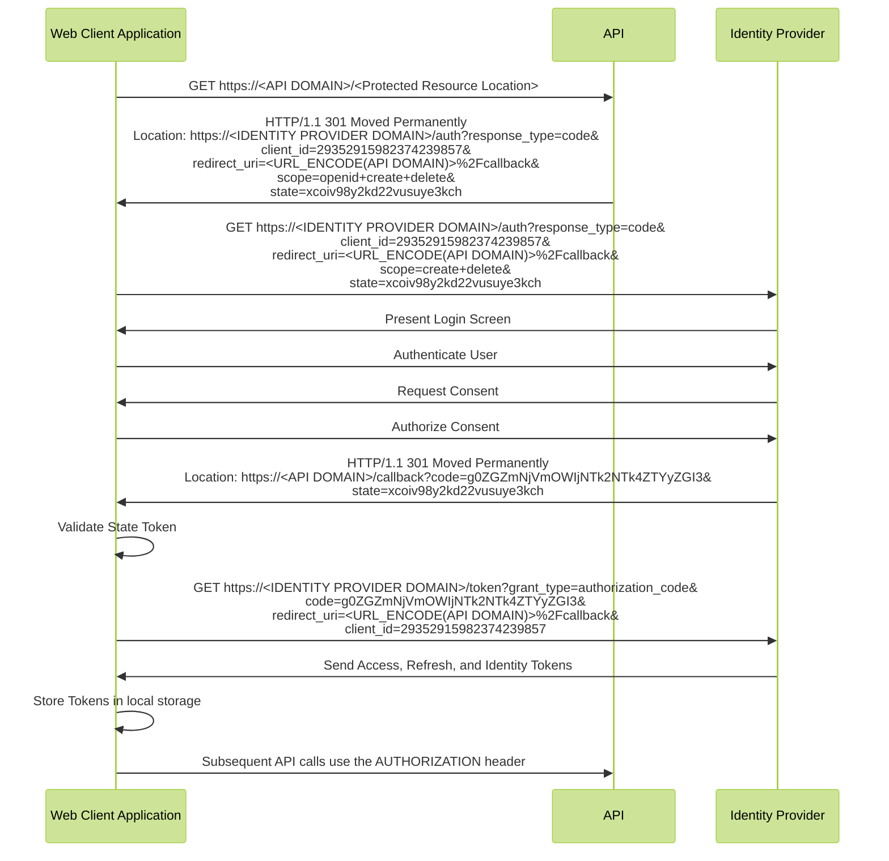

# Security Use Case Views

Detailed security use case views of a generic web application are presented below.

## Resource Owner Password Grant Login Flow

The login flow for the web application is described by the following diagram.

## Authorization Code Grant Login Flow

The login flow for the web application is described by the following diagram.

