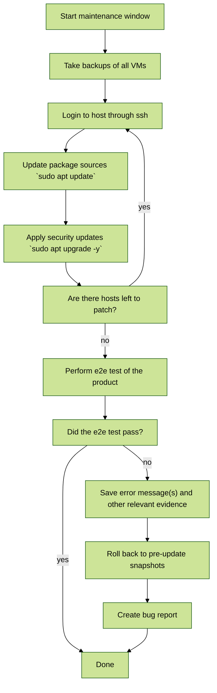
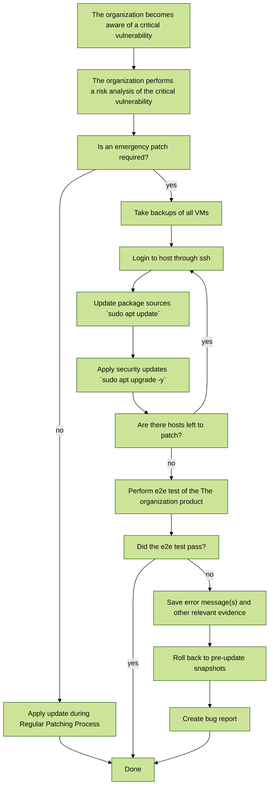
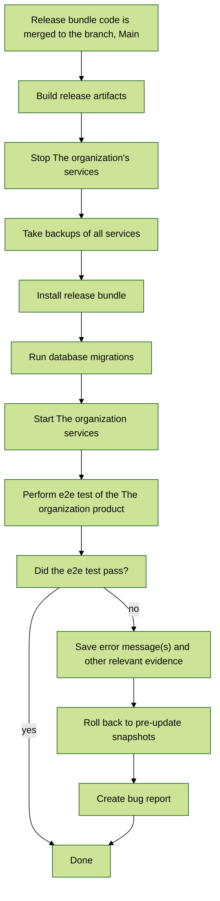
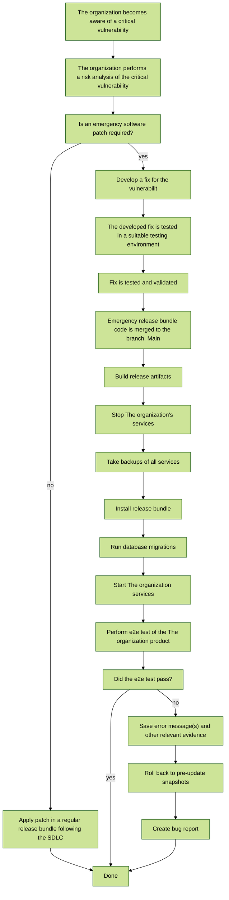

# Update and Patchability View

The organization understands that vulnerabilities will be regularly introduced into and discovered within systems during the lifetime of all developed products. Vulnerabilities may become known through either internally led processes such as vulnerability scanning and software testing or reported to The organization through external parties.

Vulnerabilities are generally introduced through one of following three layers:

- Infrastructure (Operating Systems and Cloud Platforms)
- Suppliers (third-party libraries and COTS products)
- Internally Developed Components (code and configurations)

When a vulnerability is discovered and validated to introduce an unacceptable level of risk, action is taken to mitigate the issue such that the residual risk is acceptable. For the purposes of simplicity, The organization groups mitigation activities into two types, platform and application. Platform mitigations are those that apply to the previously defined infrastructure layer (OS and Cloud Provider) and COTS products. Application mitigations are those that apply to third-party libraries and internally developed components.

Non-emergency platform vulnerabilities are generally fixed during the next maintenance window through the regular patching process. Non-emergency vulnerabilities in the The organization application are tracked in the corporate ticketing system and expected to be deployed in a regular release within the published remediation timelines. The regular patching process is described below.

Emergency platform vulnerabilities that are known to be exploited in the wild are expected to be mitigated as soon as possible through the emergency patch process. Emergency vulnerabilities in internally developed applications that are known to be exploited in the wild are expected to be patched as soon as possible by creating and deploying a hotfix release in the application component affected.

## Regular Platform Patching

The cloud platform (ie. cloud provider managed services and operating system components) hosting the The organization application components receives and install regular security updates from their upstream suppliers. The Technology team will install vendor supplied security patches in a maintenance window outside of normal business hours as shown in the following diagram.

## Emergency Platform Patching

If, during regular vulnerability management activities, The organization becomes aware of a critical or catastrophic platform vulnerability that has a high likelihood of being exploited (ie. trivial to trigger, known to be actively used by threat groups, exploit code is publicly available, etc.), the emergency patch process is to be considered. With senior engineering leadership approval, engineering immediately begins working to test and install patches or mitigations without waiting for a maintenance window as shown in the following diagram. If Operations and customer contractual turnaround time requirements are disrupted due to patching, customer coordination may be required to ensure contracts requirements are still met.

## Regular Software Bundle Release

The organization's SDLC plans for a monthly design transfer (deployment) of software bundles supporting the The organizationVivo application. Through regular software development activities, code changes and library updates which mitigate vulnerabilities are included in the regular release bundle. In general, vulnerabilities fixed within code and configuration of the The organizationVivo application are deployed in the monthly release after the mitigation is developed and validated as shown in the following diagram.

## Emergency Software Patch

If, during regular vulnerability management activities, The organization becomes aware of a critical or catastrophic vulnerability within internally developed components that has a high likelihood of being exploited (ie. trivial to trigger, known to be actively used by threat groups, exploit code is publicly available, etc.), the emergency patch process is to be considered. With senior engineering leadership approval, engineering immediately begins working to develop and validate patches or mitigations without waiting for a scheduled release as shown in the following diagram. If Operations and customer contractual turnaround time requirements are disrupted due to patching, customer coordination may be required to ensure contracts requirements are still met.

