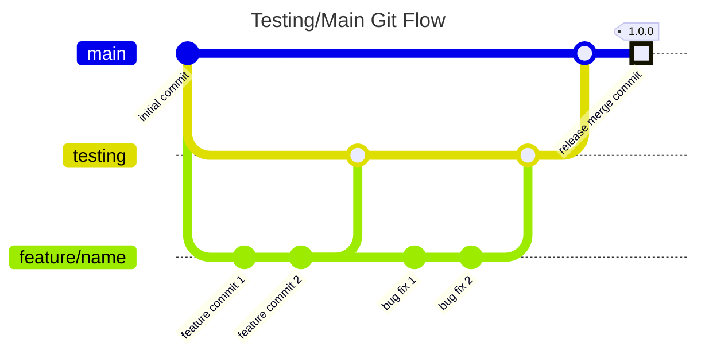

# Simple Git Flow

The following diagram illustrates a development team using a simple Git flow.

```mermaid
---
title: Testing/Main Git Flow
---
gitGraph
    commit id: "initial commit"
    branch testing
    branch feature/name
    checkout feature/name
    commit id: "feature commit 1"
    commit id: "feature commit 2"
    checkout testing
    merge feature/name
    checkout feature/name
    commit id: "bug fix 1"
    commit id: "bug fix 2"
    checkout testing
    merge feature/name
    checkout main
    merge testing
    commit id: "release merge commit" type: HIGHLIGHT tag: "1.0.0"
```
