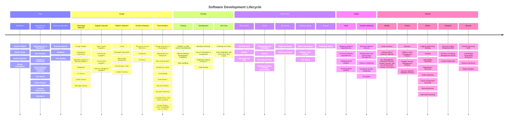

# Software Development Lifecycle

Diagrams about the Software Development Lifecycle (SDLC).

## Developer SDLC

This is the SDLC as a timeline.

```mermaid

timeline
    title Software Development Lifecycle
    section Plan
        Definitions             : Mission Problem
                                : Mission Scope
                                : Mission Approach
                                : Mission Expectations
        Requirements Gathering  : Applicable Laws & Regualtions
                                : Best Practices
                                : Compliance Frameworks
                                : Internal Software Development Guidelines
                                : User Stories
                                : Market Analysis
                                : Customer Requirements
                                : Estimations
        Resource Allocation     : Business Approval
                                : Budgeting
                                : Team Building
    section Design
        Technology Selection    : Design Pattern
                                : Language & Framework
                                : Standard Libraries & Security Patterns
                                : Databases
                                : KV Stores
                                : Cache Servers
                                : Message Queues
        Supplier Selection      : Open Source Suppliers
                                : Commercial Suppliers
                                : Government Suppliers
                                : Artificial Intelligence Suppliers
        Platform Selection      : Cloud
                                : Managed Datacenter
                                : Self-Hosted Datacenter
                                : Orchestration Tools
                                : Content Delivery
        Runtime Selection       : Physical & Virtual Machines
                                : Containers
                                : Functions
        Documentation           : Design Decisions & Assumptions
                                : Specifications & Tolerances
                                : Data Classification
                                : Architecture Views
                                : Threat Model
                                : Risk Analysis
                                : Security Policies
                                : Security Processes
                                : Complimentary User Entity Controls
                                : Privacy Policy, EULA, Acceptable Use, AI Policy
    section Develop
        Training        : OWASP & CWE Secure Development
                        : Internal Software Development Guidelines
                        : Data Handling
        Development     : Backlog Grooming
                        : Issue Prioritization & Assignment
                        : Implement Feature or Bug Fix
                        : Code Review
        Test Case       : Generate Unit Tests
                        : Write Integration and End to End Test Cases
    section Build & Test
        Environment         : Test/Prod Parity
                            : Isolation
                            : Obfuscated Test Data
        CI/CD               : Documention and Formatting
                            : Building
                            : Executing Unit Tests
                            : Deploying Pipelines to Testing Environments
        QA Tooling          : Integration Testing
                            : End to End Testing
        Security Tooling    : Static Code Analysis
                            : Dynamic Code Analysis
                            : Fuzz Testing
        Manual              : Penetration Testing
    section Deploy
        Build               : Validating Software Dependencies
                            : Archiving Software Dependencies
                            : Validating Build Artifacts
                            : Archiving Build Artifacts
        Product Hardening   : Workload Network Security
                            : Authentication and Authorization Management
                            : Platform Hardening
                            : Operating System Hardening
                            : Encryption
    section Operate
        Identify    : Asset Inventory
                    : Software Bill of Materials (SBOM)
                    : Key Management Personnel, Security System Owners, and Law Enforcement Contact Information
        Protect     : Backups
                    : Platform Patch Management Process
                    : Supplier Security Management Process
                    : Security Software Releases Process
        Detect      : Logging, Monitoring, Alerting
                    : Auditing
                    : Vulnerability Scanning
                    : Dependency Scanning
                    : Public Reporting
                    : Cloud Configuration Scanning
                    : Reconnaissance
                    : Dark Web Scanning
        Respond     : Security Incident Response (SIR)
                    : Business Continuity Management (BCM)
                    : Content Moderation
        Recover     : Disaster Recovery (DR)
                    : Coordinated Vulnerability Disclosure
                    : Breach Disclosure
                    : Public Relations
```
