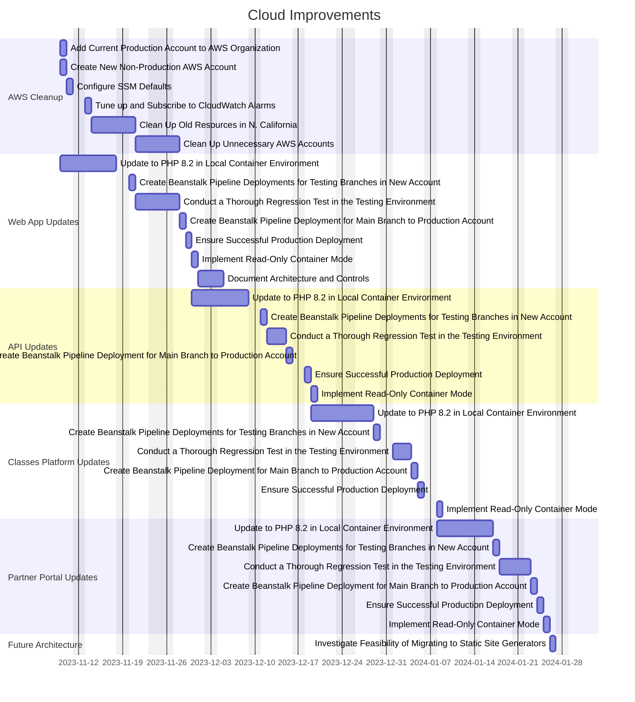

# AWS Cloud Improvements Project Plan

The following chart outlines the tasks earmarked for an AWS Cloud Improvement Project.

```mermaid
gantt
    dateFormat  YYYY-MM-DD
    title       Cloud Improvements
    todayMarker off
    excludes    2023-11-23, 2023-11-24, 2023-12-24, 2023-12-25 weekends
    %% (`excludes` accepts specific dates in YYYY-MM-DD format, days of the week ("sunday") or "weekends", but not the word "weekdays".)

    section AWS Cleanup
        Add Current Production Account to AWS Organization : clean1, 2023-11-09, 1d
        Create New Non-Production AWS Account: clean2, 2023-11-09, 1d
        Configure SSM Defaults: clean3, after clean2, 1d
        Tune up and Subscribe to CloudWatch Alarms: clean4, after clean3, 1d
        Clean Up Old Resources in N. California: clean5, after clean4, 5d
        Clean Up Unnecessary AWS Accounts: clean6, after clean5, 3d

    section Web App Updates
        Update to PHP 8.2 in Local Container Environment: web1, 2023-11-09, 7d
        Create Beanstalk Pipeline Deployments for Testing Branches in New Account: web2, after clean2 web1, 1d
        Conduct a Thorough Regression Test in the Testing Environment: web3, after web2, 3d
        Create Beanstalk Pipeline Deployment for Main Branch to Production Account: web4, after web3, 1d
        Ensure Successful Production Deployment: web5, after web4, 1d
        Implement Read-Only Container Mode: web6, after web5, 1d
        Document Architecture and Controls: web7, after web6, 2d

    section API Updates
        Update to PHP 8.2 in Local Container Environment: api1, after web5, 7d
        Create Beanstalk Pipeline Deployments for Testing Branches in New Account: api2, after clean2 api1, 1d
        Conduct a Thorough Regression Test in the Testing Environment: api3, after api2, 3d
        Create Beanstalk Pipeline Deployment for Main Branch to Production Account: api4, after api3, 1d
        Ensure Successful Production Deployment: api5, after api4, 1d
        Implement Read-Only Container Mode: api6, after api5, 1d

    section Classes Platform Updates
        Update to PHP 8.2 in Local Container Environment: classes1, after api5, 7d
        Create Beanstalk Pipeline Deployments for Testing Branches in New Account: classes2, after clean2 classes1, 1d
        Conduct a Thorough Regression Test in the Testing Environment: classes3, after classes2, 3d
        Create Beanstalk Pipeline Deployment for Main Branch to Production Account: classes4, after classes3, 1d
        Ensure Successful Production Deployment: classes5, after classes4, 1d
        Implement Read-Only Container Mode: classes6, after classes5, 1d

    section Partner Portal Updates
        Update to PHP 8.2 in Local Container Environment: partner1, after classes5, 7d
        Create Beanstalk Pipeline Deployments for Testing Branches in New Account: partner2, after clean2 partner1, 1d
        Conduct a Thorough Regression Test in the Testing Environment: partner3, after partner2, 3d
        Create Beanstalk Pipeline Deployment for Main Branch to Production Account: partner4, after partner3, 1d
        Ensure Successful Production Deployment: partner5, after partner4, 1d
        Implement Read-Only Container Mode: partner6, after partner5, 1d

    section Future Architecture
        Investigate Feasibility of Migrating to Static Site Generators: ssg1, after partner6, 1d
```
