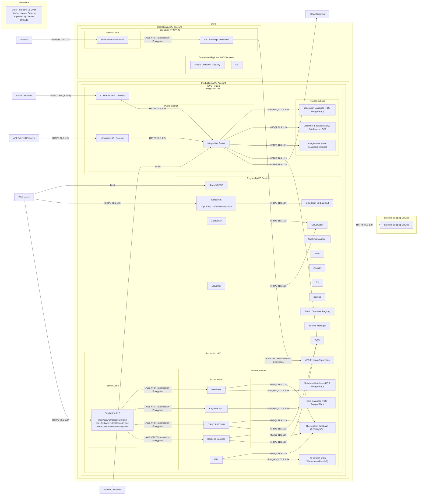

# Global System View

Nutfield Security delivers personalized engagement by identifying, capturing,
and helping to resolve security gaps that may not otherwise be found to help
businesses overcome barriers to security. Nutfield Security’s services allows
customers to build security programs, record progress against goals, capture
relevant notes about interventions and escalations, and track time for purposes
of billing and reimbursement.

The solution is a multi-tenant web-based application hosted in Amazon Web Services.
The solution is offered as a software only package where customers use the
application to facilitate their own patient outreach calls and/or as a
full-service solution where the Nutfield Security Team performs outreach calls on
the customer’s behalf. Nutfield Security customers and internal employees all access
the platform through secure TLS bindings and MFA on the web application.
Integrations to customer EHR systems are configured as needed for the specific
customer, but typically leverage some sort of TLS, SFTP, or VPN encapsulation
of the traffic to provide a secure channel for transmission.

The following global system view presents the holistic The solution cloud application
by Nutfield Security. This view of the system aims to describe all of the
internal and external connections of the individual components and is shown in
@fig:global-system-view.

