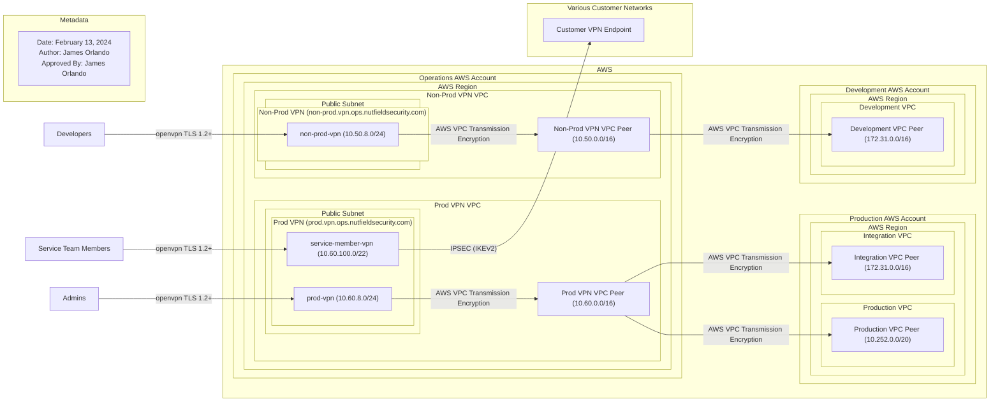

# AWS VPN Peering

In order to provide channels for secure administration of backend AWS services,
Nutfield Security maintains instances of the OPNSense open source firewall which run an
OpenVPN service allowing a secure connection into AWS. Each AWS VPC containing
a VPN connection is then peered to other AWS VPCs as desired. The current
VPN and VPC Peering configurations are shown in @fig:aws-vpn-peering-view.

Access to Nutfield Security VPNs require multiple forms of authentication. To connect to
the service, a user needs to have a valid configuration file with an embedded
client side certificate. Once connected to the service, the user also needs to
provide valid okta credentials in the form of firstname.lastname@nutfieldsecurity.com
when prompted for password authorization. The two factors then are something
you have (client side cert) and something you know (okta credentials).

